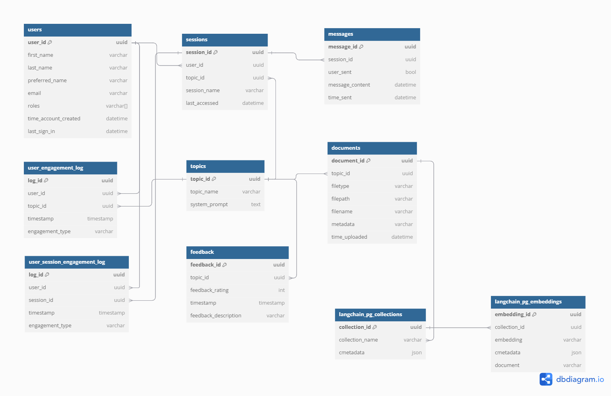

# Architecture Deep Dive

## Architecture


## Description

1. The user sends a request to the application hosted on AWS Amplify.
2. Amplify integrates with the backend API Gateway.
3. Admins can upload topic materials to the application, which are stored in an S3 bucket using a pre-signed upload URL.
4. Adding a new topic file to the S3 bucket triggers the data ingestion workflow. The Lambda function runs a Docker container with Amazon Elastic Container Registry (ECR). 
5. The Lambda function embeds the text from uploaded files into vectors using Amazon Bedrock. This project uses the Amazon Titan Text Embeddings V2 model to generate embeddings.
6. The lambda function stores the vectors in the PostgreSQL database.
7. Users can perform topic management/access actions by sending an API request which invokes a lambda function.
8. This lambda function interacts with Amazon RDS.
9. Users can start chatting with the LLM by sending an API request that invokes the Lambda function to generate a response. The Lambda function runs a Docker container with Amazon ECR.
10. The lambda function stores the embedded messages in Amazon DynamoDB
11. This lambda function uses RAG architecture to retrieve the response from LLMs hosted on Amazon Bedrock augmented with the topic's information stored in the Amazon RDS.

## Database Schema



### RDS Langchain Tables

### `langchain_pg_collection` table

| Column Name | Description                    |
| ----------- | ------------------------------ |
| `collection_id`      | The uuid of the collection     |
| `collection_name`      | The name of the collection     |
| `cmetadata` | The metadata of the collection |

### `langchain_pg_embedding` table

| Column Name     | Description                           |
| --------------- | ------------------------------------- |
| `embedding_id`            | The ID of the embeddings              |
| `collection_id` | The uuid of the collection            |
| `embedding`     | The vector embeddings of the document |
| `cmetadata`     | The metadata of the collection        |
| `document`      | The content of the document           |

### RDS PostgreSQL Tables

### `Users` table

| Column Name            | Description                             |
| ---------------------- | --------------------------------------- |
| `user_id`              | The ID of the user                      |
| `user_email`           | The email of the user                   |
| `username`             | The username of the user                |
| `first_name`           | The first name of the user              |
| `last_name`            | The last name of the user               |
| `preferred_name`       | The preferred name of the user          |
| `time_account_created` | The time the account was created in UTC |
| `roles`                | The roles of the user                   |
| `last_sign_in`         | The time the user last signed in in UTC |

### `Topics` table

| Column Name             | Description                                     |
| ----------------------- | ----------------------------------------------- |
| `topic_id`             | The ID of the topic                            |
| `topic_name`           | The name of the topic                          |
| `system_prompt`         | The system prompt for the topic                |


### `Documents` table

| Column Name           | Description                                  |
| --------------------- | -------------------------------------------- |
| `document_id`             | The ID of the file                           |
| `topic_id`           | The ID of the associated topic              |
| `filetype`            | The type of the file (e.g., pdf, docx, etc.) |
| `filepath`            | The path to the file in the S3 bucket        |
| `filename`            | The name of the file                         |
| `time_uploaded`       | The timestamp when the file was uploaded     |
| `metadata`            | Additional metadata about the file           |

### `Sessions` table

| Column Name                  | Description                                                                  |
| ---------------------------- | ---------------------------------------------------------------------------- |
| `session_id`                 | The ID of the session                                                        |
| `user_id`          | The ID of the associated user                                      |
| `topic_id` | The ID of the associated topic |
| `session_name`               | The name of the session                                                      |
| `last_accessed`              | The timestamp of the last time the session was accessed                      |

### `Messages` table

| Column Name       | Description                                           |
| ----------------- | ----------------------------------------------------- |
| `message_id`      | The ID of the message                                 |
| `session_id`      | The ID of the associated session                      |
| `user_sent`    | Whether the message was sent by the user (boolean) |
| `message_content` | The content of the message (currently unused)         |
| `time_sent`       | The timestamp when the message was sent               |

### `User_Engagement_Log` table

| Column Name       | Description                                  |
| ----------------- | -------------------------------------------- |
| `log_id`          | The ID of the engagement log entry           |
| `user_id`         | The ID of the user                           |
| `topic_id`       | The ID of the associated topic              |
| `timestamp`       | The timestamp of the engagement event        |
| `engagement_type` | The type of engagement (e.g., topic access) |

### `User_Session_Engagement_Log` table

| Column Name       | Description                                  |
| ----------------- | -------------------------------------------- |
| `log_id`          | The ID of the engagement log entry           |
| `user_id`         | The ID of the user                           |
| `session_id`       | The ID of the associated session              |
| `timestamp`       | The timestamp of the engagement event        |
| `engagement_type` | The type of engagement (e.g., session start) |

### `Feedback` table

| Column Name       | Description                                  |
| ----------------- | -------------------------------------------- |
| `feedback_id`          | The ID of the feedback entry           |
| `topic_id`         | The ID of the topic the feedback is for                           |
| `feedback_rating`       | The rating of the feedback              |
| `timestamp`       | The timestamp of the feedback event        |
| `feedback_description` | The description of the feedback |

## S3 Structure

```
.
├── {topic_id_1}
│   └── documents
│      ├── document1.pdf
│      └── document2.pdf
└── {topic_id_2}
    └── documents
        ├── document1.pdf
        └── document2.pdf

```
