# User Guide

**Please ensure the application is deployed, instructions in the deployment guide here:**
- [Deployment Guide](./deploymentGuide.md)

Once you have deployed the solution, the following user guide will help you navigate the functions available.

| Index    | Description |
| -------- | ------- |
| [Administrator View](#admin-view)  | How the Admnistrator views the project | 
| [User View](#user-view)  | How the User views the project |

## Administrator View
To sign up as an administrator, you need to sign up regularly first as a user:
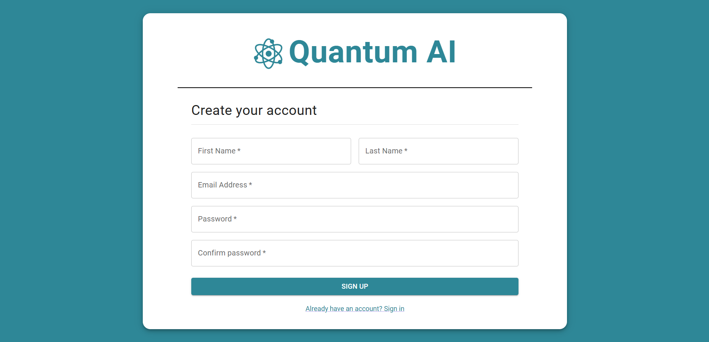

You then get a confirmation email to verify your email. Once you have a user account, to become an adminstrator, you need to change your user group with Cognito through the AWS Console:
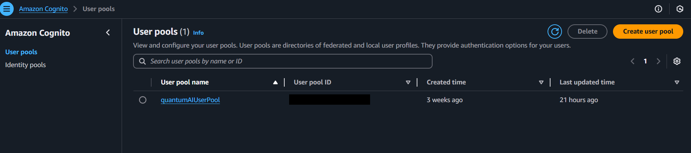

After clicking the user pool of the project, you need to find your email:

After clicking your email, you can add the 'admin' user group:
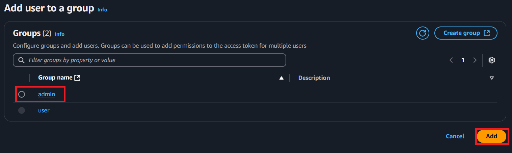
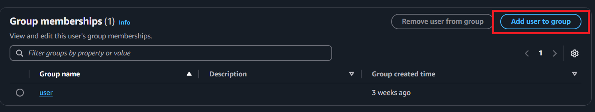
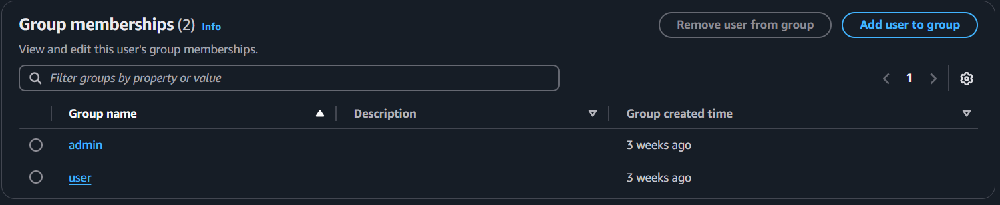

Once the 'admin' user group is added, delete the 'user' user group:
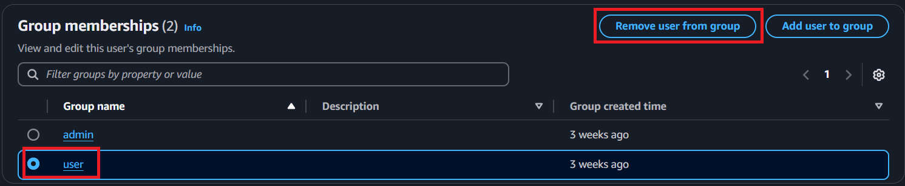
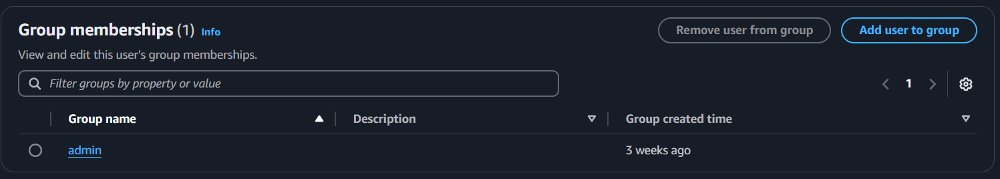

Upon logging in as an administrator, you see the following home page:
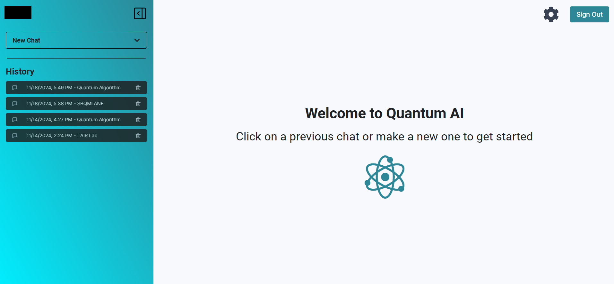
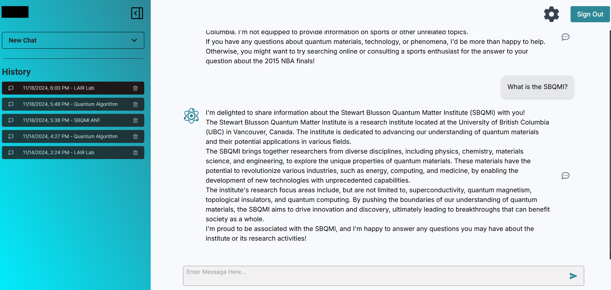

Hovering over the New Chat button gives you a dropdown from which you can select the topic of the conversation you want to start. If you do not have a specific topic for your query, you can choose the General topic.
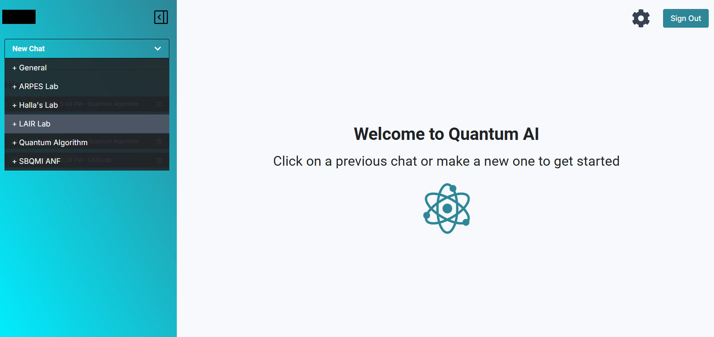

Once you've started a new chat you can enter your query and the LLM will answer.
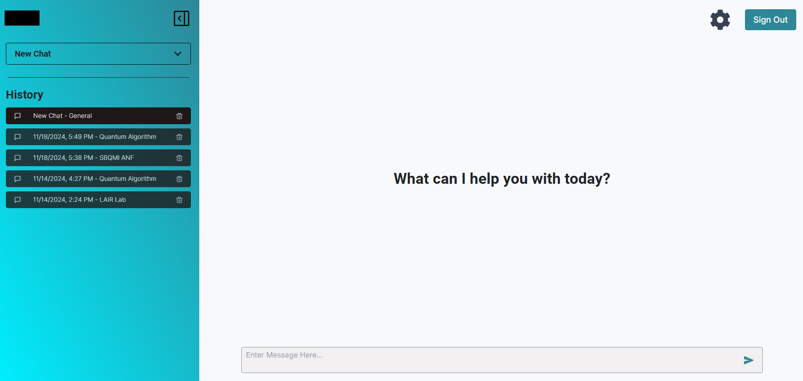

You can also provide feedback for the LLM's responses which will be helpful for admins.
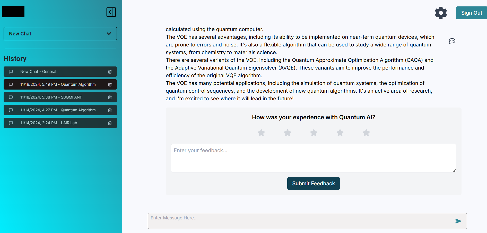

Clicking on the gear icon opens a menu of options where, as an admin, you can manage the topics and see analytics for the application.
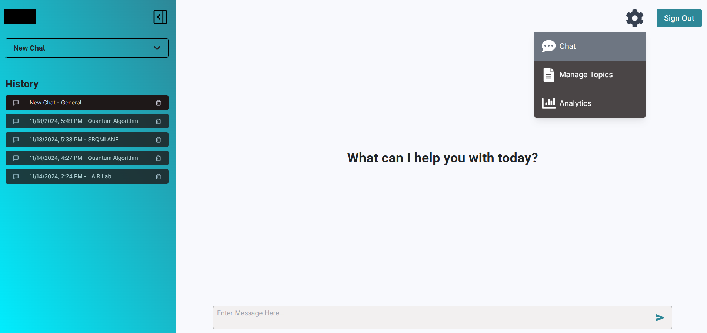

On the Manage Topics page, you are able to edit existing topics or create new ones.
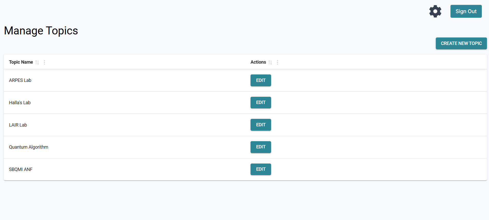

If you want to edit an existing topic, you are able to change the topic name, the topic prompt, which will be passed as the system prompt to the LLM, and the documents in this topic, which the LLM can refer to when answering any user queries.
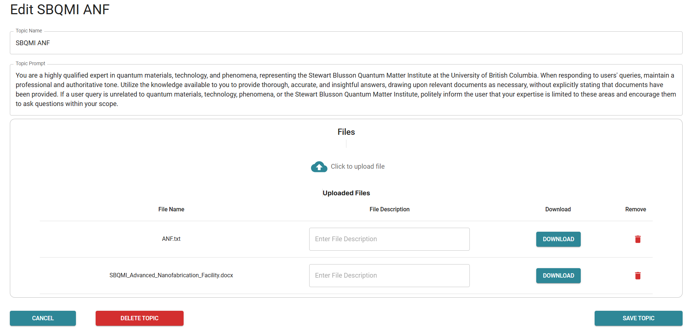

If you want to create a new topic, you fill out the same fields and upload the documents needed for that topic.
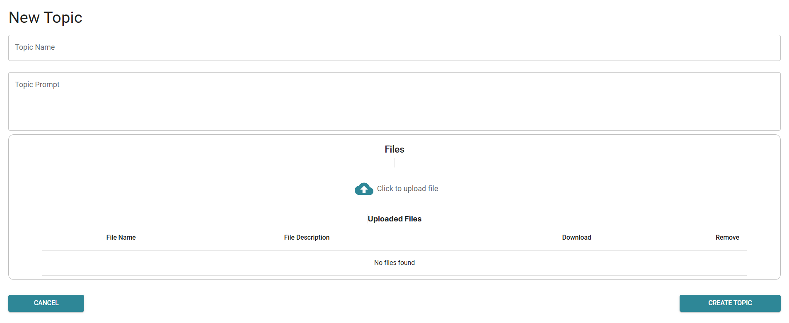

On the Analytics page, you can view metrics on how users are engaging with the application including statistics on each topic as well as feedback for each topic.
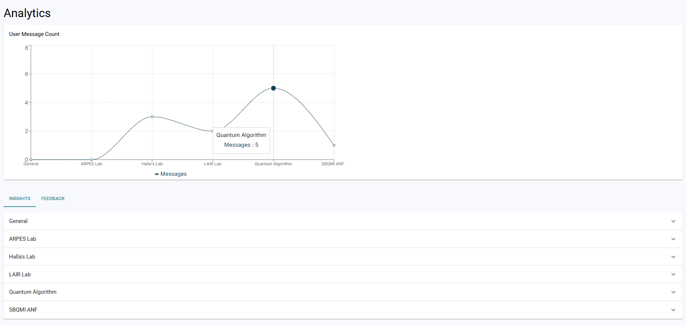
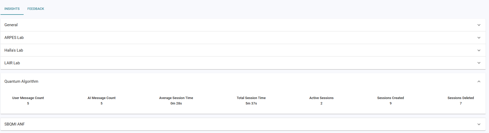
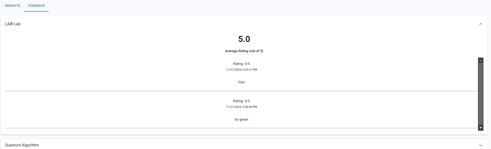

## User View
Upon logging in as a user, you see the following home page:
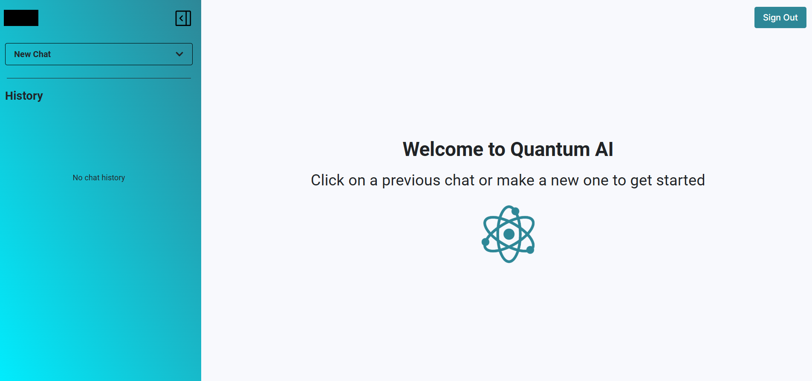

The functionality of the user is the same as that of an admin except users do not have the ability to Manage Topics or see the Analytics page. Therefore, users do not have the gear icon that admins have.